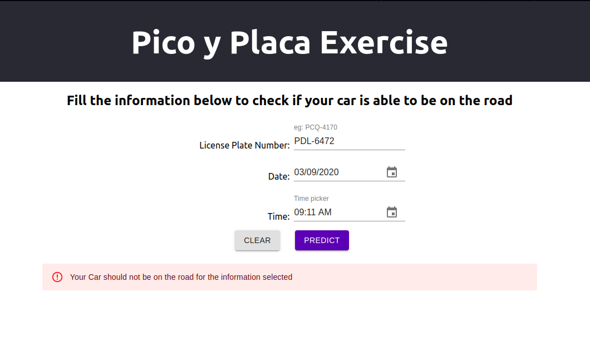

# Pico y Placa Exercise

Pico y placa is a Ecuadorian goverment law movement restriction for cars that have specific plate number for each weekday in order to improve the traffic in the city.

## For this exercise I have used the following libraries:

- Material UI Components
- prop-types (typing components props)
- date-fns (required for date time pickers)

## In order to run the application do the following:

- Clone the repository
- Go to this path in your terminal: `picoyplaca/picoyplaca-app`
- run: `npm install`
- run: `npm start`

## Unit tests:

I have added few unit tests:

- App.test.jsx: renders header and its text correctly
- content.test.jsx: render all texts for different components and also verified buttons are disabled on first render
- alert.test.jsx: test when red and green alert is rendered

To verify test are running correctly run the following command on your terminal:

`npm test`

## Demo

